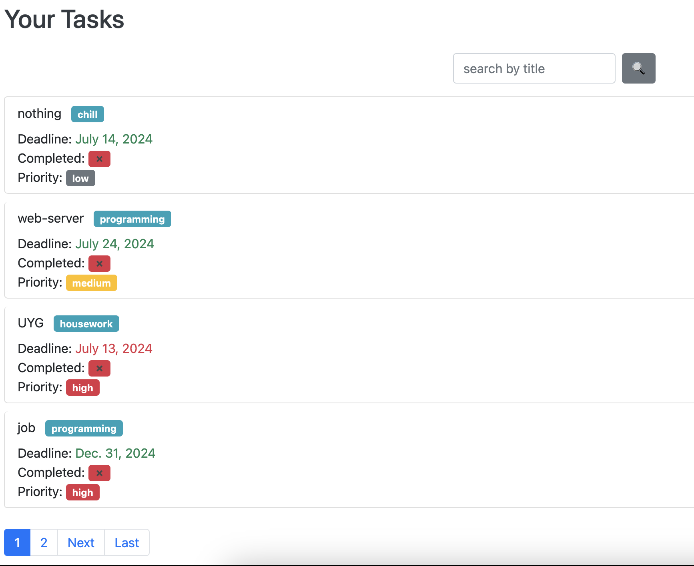

# toDo-list-project

# Introduction
Welcome to our Django-based application. This project is designed to manage tasks with a streamlined user interface, providing features such as task creation, user management, and pagination. The application aims to simplify the process of task tracking and user management within an organization or personal projects.

# Site is also already hosted on a free platfom, here is the link:
https://todo-list-project-0df5.onrender.com

# Key Features
1) Task Management
- Create, View, and Edit Tasks: Users can create new tasks, view task details, and edit existing tasks.
- Pagination: Efficiently browse through tasks with pagination on the task list page.

2) User Management
- User Creation: Admins can create new users through a dedicated form.
- User Information: View and update user information.

3) Tags Management
- Tag Creation and Management: Add and manage tags associated with tasks, improving organization and searchability.

4) Admin Panel
- Admin Interface: A robust admin panel for managing the application's data and configurations

# Installation Instructions
- git clone https://github.com/Timur5050/toDo-list-project.git
- cd toDo-list-project
- python -m venv env
- env\Scripts\activate or source env/bin/activate on mac
- pip install -r requirements.txt
- python manage.py migrate
- python manage.py runserver
- go to http://127.0.0.1:8000/

# Usage Guide
- Main Page, URL: /, View: index. This is the main landing page of the application.
- User Registration, URL: /registration/, View: UserCreateView.as_view(). Allows users to register a new account.
- User Information, URL: /users/<str:username>/, View: user_about. Displays information about a specific user.
- Task List, URL: /tasks/, View: tasks_list. Displays a list of tasks, with pagination.
- Task Creation, URL: /tasks/create/, View: task_create_view. Allows users to create a new task.
- Task Details, URL: /tasks/<int:pk>/details/, View: task_detail_view. Displays the details of a specific task.
- Task Completion Status Change, URL: /tasks/<int:pk>/completing/, View: task_completing_view. Allows users to change the completion status of a specific task.
- Tags List, URL: /tags/, View: tags_list. Displays a list of tags.
- Tag Creation, URL: /tags/create/, View: tag_create. Allows users to create a new tag.

# demo

